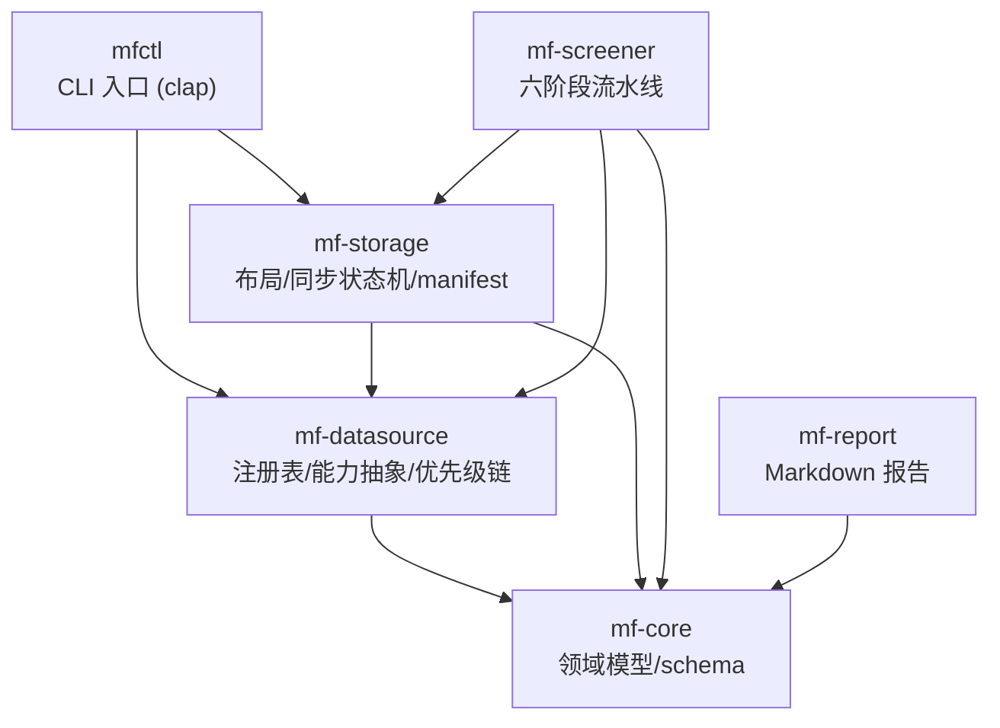
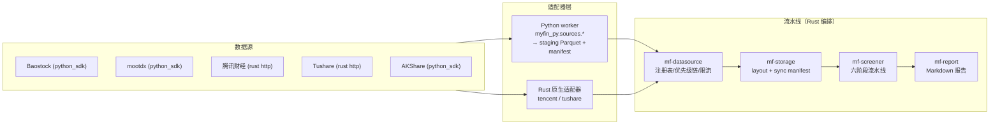
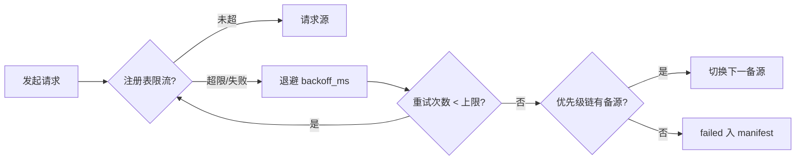

# myfin 架构

> 状态：v1（对应 M1 骨架已完成，M2 起逐步落地）· 数据源：`docs/data-sources.md` ·
> 策略：`docs/strategy.md`。文中标注「M2/M3/M4」的为里程碑计划，见第 9 节。

## 1. 总览

Rust workspace + Python worker 双语言架构：

- **Rust**：领域模型、数据源注册表、存储层、流水线、报告、CLI。负责编排、校验与查询。
- **Python**：三个 Python SDK 数据源适配器（baostock / mootdx / akshare），
  写入 staging Parquet + manifest，由 Rust 侧校验接管。
- 数据统一为 Parquet（M2 引入 DuckDB 查询引擎，SQLite 可选）。

## 2. crate 结构与依赖



各 crate 职责（均为 `crates/<name>`）：

| crate | 职责 | 关键内容 |
| --- | --- | --- |
| `mf-core` | 领域模型与统一 schema，零依赖外部 crate（仅 serde/chrono/thiserror） | `DailyBar`/`AdjFactor`/`FinancialData`/`EarningsNotice`/`PriceVal`/`ValuationPoint`/`Symbol`/`Error` |
| `mf-datasource` | 数据源抽象（`Source` trait）、注册表（`Registry`）、数据集与优先级链 | 加载并校验 `config/sources.toml` |
| `mf-storage` | 数据目录布局、Parquet 接管、DuckDB 查询、增量同步状态机 | `Layout`/`ParquetStore`/`SyncManifest` |
| `mf-screener` | 六阶段选股流水线（universe→…→output） | 参数来自 `config/screen.toml` |
| `mf-report` | Markdown 报告渲染（`MarkdownReport`/`Candidate`） | 候选清单表格 + 数据质量页 |
| `mfctl` | CLI 入口（`--registry`/`--data-dir` 全局参数 + 7 个子命令） | 见第 8 节 |

依赖方向单向向下：`mfctl` 依赖其余全部，`mf-datasource`/`mf-storage`/`mf-screener`/`mf-report`
只依赖 `mf-core`，不允许反向依赖。

## 3. 数据流



数据流逐级说明：

1. **源 → 适配器**：`config/sources.toml` 注册表声明每个源的能力（kind/lang/限流/探针）与数据集；
   适配器实现 `Source` trait（rust）或 worker 模块（python），产出符合 `mf-core` schema 的记录。
2. **适配器 → staging Parquet**：Python worker 按标的写入 staging Parquet，`mfctl sync` 校验
   staging manifest，只接管 `done` 记录，再由 `ParquetStore::ingest_parquet_by_year`
   重新编码到 `data/` 对应目录；同步状态写入落库 manifest。
3. **Parquet → 查询**（M2）：`mf-storage::ParquetStore` 使用 DuckDB 读取数据集，支持按年分区、幂等合并和日线查询；SQLite 可选用于小表。
4. **流水线**：`mf-screener` 按 `config/screen.toml` 参数执行六阶段，产出候选清单。
5. **报告**：`mf-report` 渲染 Markdown 到 `data/reports/`。

## 4. 存储布局

布局定义在 `crates/mf-storage/src/layout.rs`，数据根目录默认 `data/`，
可用环境变量 `MYFIN_DATA` 覆盖（`mfctl --data-dir` 优先级更高）。

```text
data/
├── market/
│   ├── daily/           不复权日 K（OHLCV，按年分文件 market/daily/<year>/）
│   │                     price_val（股本）也落在本目录（Dataset::dir 约定）
│   └── adj_factor/      复权因子（后复权累计因子，baostock 主源）
├── financial/           季频财务快照 + 业绩预告/快报（按年分文件）
├── macro/               宏观指标（akshare，辅助）
├── reports/             Markdown 报告（mfctl report 输出，data/reports/backtest-*.md 为回测表）
├── context/             环境扫描背景文档（agent 生成，只润色不创造数据）
└── sync/                增量同步状态 manifest（JSONL 追加式，每数据集一个文件）
```

约定：

- `market/daily` 与 `financial` 按**年分文件**（`dataset_year_dir(dataset, year)`），
  保证 append 式增量写入与按年裁剪；`adj_factor`/`macro` 为全量重拉式数据集，不分年。
- manifest 路径 `data/sync/<dataset>.jsonl`（`Layout::manifest_path`）。
- `data/` 全部内容（除 reports 中需保留的）可重建，已加入 `.gitignore`。

## 5. IPC 边界：Python worker 与 Rust

### 5.1 协议

- **无 RPC**：Python worker 不向 Rust 进程实时通信，唯一的交接点是**文件**。
- **staging manifest**：worker 在每次运行的 staging 目录写入 `manifest.jsonl`，
  每行一个 `StagingEntry`，键为 `(dataset, source, symbol)`，由
  `crates/mf-storage/src/staging.rs` 严格解析。
- **落库 manifest**：`mfctl sync` 仅接管 `done` staging 记录，并在
  `data/sync/<dataset>.jsonl` 追加按日期聚合的 `SyncEntry` JSON
  （`crates/mf-storage/src/sync.rs`）：

```json
{"dataset":"daily","source":"baostock","trade_date":"2026-08-03",
 "status":"done","rows":5400,"updated_at":"2026-08-03T12:00:00Z","note":null}
```

- 幂等性：manifest 是**追加式**（`record` 以 `(dataset, source, trade_date)` 为键，
  后写覆盖先写在内存索引中），断点续跑重复写同一键不会损坏数据。

### 5.2 适配器注册

- `config/sources.toml` 中 `kind = "python_sdk"` 的源声明 `package` 字段
  （如 `myfin_py.sources.baostock_source`），worker 侧模块路径与之一一对应；
  当前注册的 python 包路径：`myfin_py.sources.{baostock_source, akshare_source, mootdx_source}`
  （`py/src/myfin_py/sources/` 下，适配器代码 M3 落地）。
- Rust 原生适配器（`kind = "http"`）为 tencent / tushare，直接内联于 Rust 侧。

## 6. 增量同步状态机

单人维护项目最容易烂尾的是增量同步，故用显式状态机管理（`mf-storage/src/sync.rs`）。

- 键：`(dataset, source, trade_date)`；状态枚举 `SyncStatus`：

| 状态 | 含义 | 后续动作 |
| --- | --- | --- |
| `done` | 成功 | 无 |
| `partial` | 部分成功（如个别股票缺失） | 下次重试补齐缺行 |
| `failed` | 失败（需重试或人工排查） | `mfctl sync` 重试；持续失败转人工 |
| `skipped` | 跳过（停牌/非交易日/源无此交易日数据） | 不视为缺口 |

- **缺口检测**：`SyncManifest::missing_dates` 以交易日历为期望，找 `(dataset, source)` 缺失的日期，
  断点续跑只补缺口；`failed_entries` 汇总所有失败项供 `mfctl doctor` 报告。
- **重试**：failed 条目进入重试队列，遵守源的 `rate_limit`（见下）。

## 7. 限流 / 重试 / 熔断

限流参数由注册表声明（`RateLimit { min_interval_ms, max_calls_per_minute, max_calls_per_day, backoff_ms }`），
适配器实现要求（`Source` trait 文档）在内部以 token bucket 执行，不得暴力请求。



- **优先级链**：`config/sources.toml` 的 `chains` 定义每个数据集的备源顺序
  （如 `daily: mootdx → tencent → tushare`），主源失败自动顺延，不需要人工介入。
- **熔断**：某源连续失败达到阈值（实现中按 `max_calls_*` 与连续错误计数）后，
  当周期内不再直连该源，全部流量走备源；恢复窗口期用探针复测。
- 无 token 的源（baostock/mootdx/腾讯）没有额度上限，`max_calls_per_minute/day` 为 `null`；
  tushare 免费档硬上限 50 次/分钟、8000 次/天（见 `docs/data-sources.md`）。

## 8. CLI（mfctl）

入口 `crates/mfctl/src/main.rs`，全局参数：`--registry`（默认 `config/sources.toml`）、
`--data-dir`（默认 `$MYFIN_DATA` 或 `data/`）。

| 子命令 | 说明 | 实现状态 |
| --- | --- | --- |
| `sources list` | 列出注册表源与优先级链 | ✅ M1 已实现 |
| `sources check` | 全源健康检查（基准股探针） | M3：Python + Rust HTTP 已接入 |
| `sync` | 增量同步单源单标的数据 | M3：Python SDK + Rust HTTP daily 已接入 |
| `screen` | 运行选股流水线 | M4 实现 |
| `report` | 生成 Markdown 报告 | M4/M5 实现 |
| `doctor` | 数据目录健康审计（目录统计） | ✅ M1 已实现 |
| `verify` | 跨源抽查对账 | M3/M4 实现 |
| `backtest` | 历史月度截面重建回测 | M4 实现 |

尚未实现的子命令当前输出占位提示（`cmd_pending`），不影响注册表解析与目录审计。

## 9. as-of 模块

所有因子计算的时点纪律（防前视偏差，规格见 `docs/strategy.md` §8.4）：

- 配置：`as_of.ann_date_approx_days = 60`（`config/screen.toml`）；
- 财务数据按 `ann_date`（报告期末 + 60 天近似）过滤，只有 `ann_date <= as_of` 的快照可被使用；
- 分位/动量/均线等时间窗因子一律以 as-of 日收盘为窗口末端；
- 该模块由 `mf-screener` 在 M4 实现，回测与实盘共用同一 as-of 逻辑，杜绝「回测能用未来数据」。

## 10. 质量门

`mfctl doctor` / `verify` 覆盖三类检查（M3/M4 逐步落地）：

1. **OHLC 一致性**：`high >= max(open, close)` 且 `low <= min(open, close)`、
   `volume >= 0`、`amount >= 0`；违例记录并标记该 `(source, date)` 为 `partial`。
2. **跨源抽样对账**：`mfctl verify` 对同一标的同一交易日取 2 个源（如 mootdx vs 腾讯）的收盘价
   抽样比对，偏差超阈值（如 0.1%）即告警——用于抓前复权/字段错位类系统性错误。
3. **行数骤变**：manifest 的 `rows` 与相邻日期对比，单日行数骤降（如 -50%）
   视为漏拉或源故障，阻断该日数据进入流水线。

质量门结果进入报告的数据质量页（`mf-report` 的 `SourceHealthLine`）。

## 11. 里程碑

| 里程碑 | 内容 | 当前状态 |
| --- | --- | --- |
| M1 | workspace 骨架、mf-core 领域模型、注册表、布局 + manifest、CLI 骨架、Python worker 三源、docs + skill | ✅ 完成（fd92776） |
| M2 | 存储层：Parquet 写入 + DuckDB 查询引擎（SQLite 可选） | ✅ 完成 |
| M3 | 数据源适配器（Rust HTTP 两源）、增量同步、`sources check`/`sync`/`verify` | 进行中：HTTP daily 已接入，verify 待做 |
| M4 | 选股流水线 + as-of 模块 + 月度截面重建回测（`screen`/`backtest`） | 待做 |
| M5 | 报告完善（候选清单 + 数据质量页）、环境扫描 context 流程 | 待做 |
| M6 | 硬化：熔断/重试打磨、质量门补全、文档收尾 | 待做 |

## 12. 仓库布局

```
myfin/
├── Cargo.toml                        # workspace（6 crates）
├── crates/
│   ├── mf-core/                      # 领域模型与统一 schema（bar/financial/symbol/valuation/error）
│   ├── mf-datasource/                # 注册表、Source trait、HTTP 适配器、优先级链
│   ├── mf-storage/                   # 数据目录布局 + 增量同步状态机（manifest）
│   ├── mf-screener/                  # 选股流水线配置（config.rs，对应 config/screen.toml）
│   ├── mf-report/                    # Markdown 报告渲染器
│   └── mfctl/                        # CLI 入口（main.rs）
├── py/src/myfin_py/                  # Python worker：sources/（baostock/akshare/mootdx）
│                                     # schema.py（统一 schema）+ worker.py（CLI，写 staging Parquet + manifest）
├── config/
│   ├── sources.toml                  # 数据源注册表（AI 维护）
│   └── screen.toml                   # 筛选参数
├── docs/                             # philosophy/strategy/architecture/data-sources + adr/
├── data/                             # 本地数据（gitignored）：market/ financial/ macro/ sync/ reports/ context/
└── .agents/skills/data-source-maintenance/   # 数据源维护 skill（随仓库分发）
```

## 13. 常用命令

```bash
# Rust 构建与测试
cargo build
cargo test

# mfctl CLI（工作目录为仓库根）
./target/debug/mfctl sources list            # 注册表与优先级链
./target/debug/mfctl sources check           # 源健康检查（M3 落地）
./target/debug/mfctl doctor                  # 数据目录健康审计
./target/debug/mfctl sync --source baostock --dataset daily --symbol 600519.SH \
    --start 2021-01-01 --end 2026-08-05        # Python SDK 单标的同步
./target/debug/mfctl sync --source auto --dataset daily --symbol sh600519 \
    --start 2021-01-01 --end 2026-08-05        # 按 daily 优先级链自动故障切换
./target/debug/mfctl screen                  # 选股流水线（M4 落地）
./target/debug/mfctl report                  # Markdown 报告（M5 落地）
./target/debug/mfctl verify --symbol 600519.SH --start 2021-01-01 --end 2026-08-05 \
                                             # 跨源抽查对账（要求同日多源数据）
./target/debug/mfctl backtest                # 历史月度截面回测（M4 落地）

# Python 环境与 worker（Python SDK 独占源）
uv sync --project py
uv run --project py python -m myfin_py.worker list-sources
uv run --project py python -m myfin_py.worker health-check
uv run --project py python -m myfin_py.worker fetch-daily \
    --source baostock --symbol 600519.SH --start 2021-01-01 --end 2026-08-05 --out data/staging

# 新 py 文件提交前校验
uv run --project py python -m py_compile <file>
```

`mfctl` 会自动发现仓库根目录下的 `py/.venv`；如需指定其他 Python，
可设置 `MYFIN_PYTHON` 环境变量覆盖自动发现结果。
